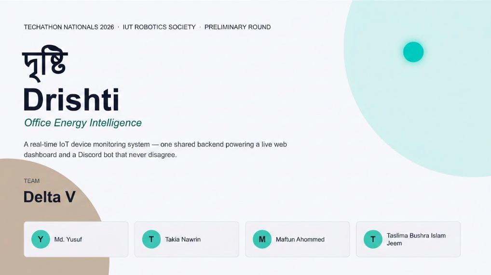
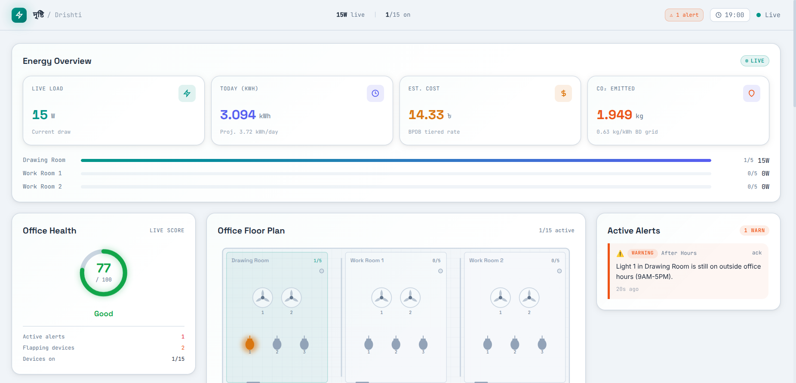
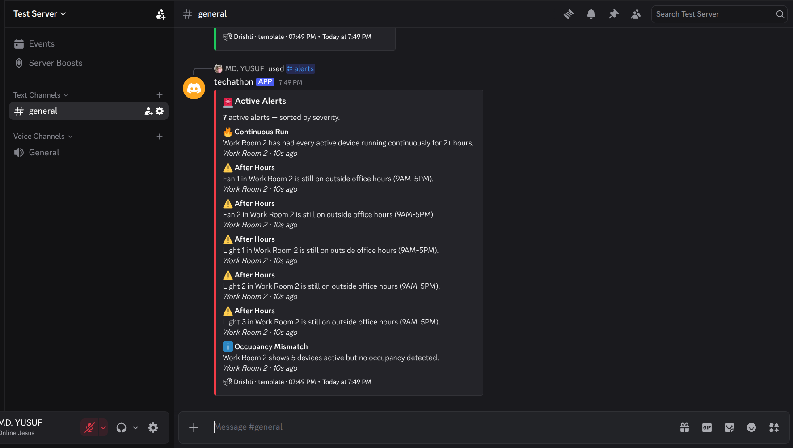
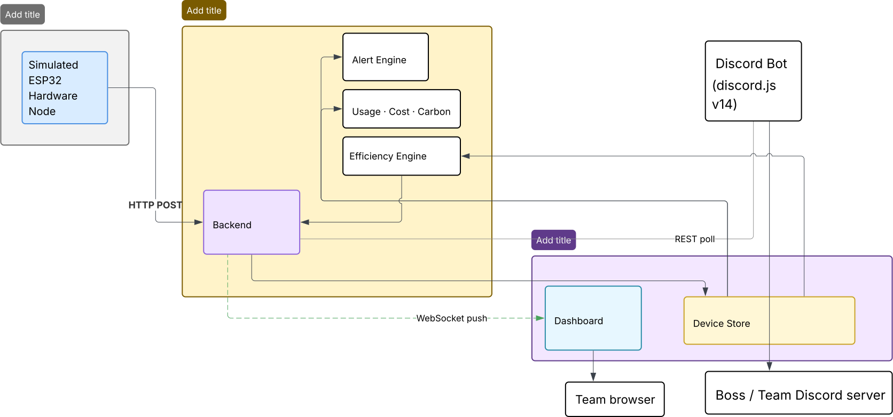
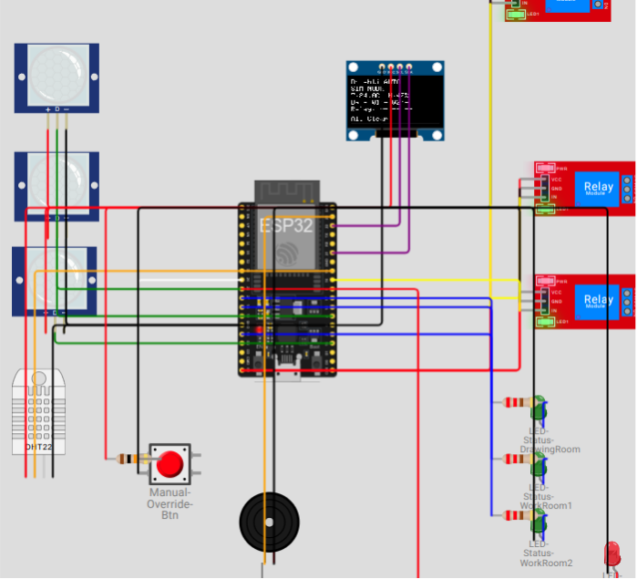

# দৃষ্টি — Drishti



**Office Energy Intelligence** — a real-time IoT device monitoring system built for Techathon Nationals 2026 (Preliminary Round, IUT Robotics Society).

Drishti watches an office's lights and fans so people don't have to — a live web dashboard, a Discord bot, and one backend they both trust completely.

## Project Previews

| Web Dashboard | Discord Bot Anomaly Notification |
|---|---|
|  |  |

---

## 1. Problem Understanding

The brief: an office loses money because lights and fans get left running after
people go home. The ask is a system that makes device state and power usage
**visible and queryable** through two interfaces — a web dashboard and a
Discord bot — both reading from one shared source of truth, so they can never
disagree with each other.

Fixed scope: 3 rooms (Drawing Room, Work Room 1, Work Room 2), each with
2 fans + 3 lights → **15 devices total**.

## 2. Solution Approach & Architecture

Here is the system architecture block diagram:



```
Simulated Device Layer → Event-Sourced Device Store → Backend (Express + Socket.IO)
                                                              ├──> Web Dashboard (WebSocket push)
                                                              └──> Discord Bot (REST poll)
```

**Key architectural decision: event sourcing, not snapshots.** Every device
state change is appended to an immutable event log rather than just
overwriting a `isOn` flag. This is what makes several features *correct*
instead of *approximated*:

- "Has this device been on continuously for 2+ hours?" is computed by walking
  the actual event history backward, not by trusting a single `lastChanged`
  timestamp that could be stale or wrong.
- Today's kWh usage is calculated by integrating real on/off intervals
  (watt-hours), not `current_watts × hours_elapsed`.
- The activity heatmap and phantom-load detection are free byproducts of
  having history at all — they'd need a separate persistence mechanism in a
  snapshot-only design.

**Single backend, single process.** The Express server serves the built React
dashboard as static files *and* the REST/WebSocket API from the same port.
This means one `npm start` and one URL — no CORS configuration, no "which
port is the frontend on again" during judging.

## 3. Technologies Used

| Layer | Stack |
|---|---|
| Language | TypeScript everywhere (shared types package eliminates contract drift between backend/bot/frontend) |
| Backend | Node.js, Express, Socket.IO |
| Frontend | React 18, Vite, Tailwind CSS, Recharts |
| Discord Bot | discord.js v14 (prefix + slash commands) |
| AI | Multi-provider fallback chain — Groq (Llama 3.3 70B) → Google Gemini 2.0 Flash → OpenRouter free models → deterministic template engine |
| Testing | Vitest (backend logic: alert engine, usage engine) |

### Why one language, not a polyglot stack

The hard architectural requirement here is "one backend, one source of
truth." A single TypeScript codebase with a shared `@drishti/shared` types
package means the compiler — not manual discipline — prevents the dashboard,
bot, and backend from silently drifting apart on what a "Device" or "Alert"
looks like. For a system that has to work flawlessly during a live 5-minute
demo, that's a real reliability property, not just developer convenience.

### Why a multi-provider LLM fallback instead of one provider (or a local model)

Three independent free-tier providers means exhausting one doesn't take the
bot down, and none of it depends on the judges' — or your — laptop having
GPU headroom. If every provider is unavailable, the bot falls back to a
hand-written template layer tuned to sound the same as the AI path. The bot
is designed to never visibly go offline.

## 4. AI Integration Details

- **Models used:** `llama-3.3-70b-versatile` (Groq), `gemini-2.0-flash` (Google), `meta-llama/llama-3.1-8b-instruct:free` (OpenRouter).
- **No training/fine-tuning** — this is prompt-based generation over live,
  real simulated data (never hardcoded or randomly generated bot copy).
- **Prompting approach:** each bot response builds a prompt containing only
  the relevant slice of current state (e.g. one room's devices, not the
  whole office) and asks for a short, conversational, markdown-free summary.
- **Fallback behavior:** `backend`-side is untouched by LLM logic entirely —
  the fallback chain and templates live in the `bot` package, since that's
  the only place conversational generation is needed.
- **Failure handling:** each provider call has a 7s timeout and is wrapped so
  a thrown error moves to the next provider rather than crashing the command.

## 5. Setup & Installation

### Prerequisites
- Node.js 18+ and npm 9+
- (Optional, for the bot) free API keys from any of: [Groq](https://console.groq.com), [Google AI Studio](https://aistudio.google.com/app/apikey), [OpenRouter](https://openrouter.ai/keys)
- (Optional, for the bot) a Discord bot token — see Section 8 below

### One-command setup

```bash
git clone <this-repo-url>
cd drishti
npm install        # installs all workspaces AND builds the shared types package
cp backend/.env.example backend/.env
# edit backend/.env — add any LLM keys and Discord bot token if you want the bot live
npm run dev         # runs backend + bot + frontend concurrently
```

Then open **http://localhost:5173** (dashboard dev server, hot-reloading) or,
for the exact single-process setup used at judging:

```bash
npm run build       # builds shared, frontend, backend, bot
npm start           # serves everything from http://localhost:8000
```

If you don't have a Discord token yet and just want to see the dashboard:

```bash
npm run dev:no-bot
```

### Running tests

```bash
npm test
```

## 6. How to Run the Application

- **Dashboard:** open the URL printed by the backend (`localhost:8000` in
  production mode, `localhost:5173` in dev mode — the dev server proxies API/
  WebSocket calls to `8000` automatically).
- **Discord bot:** once `DISCORD_BOT_TOKEN` and `DISCORD_CHANNEL_ID` are set
  in `backend/.env` (see Section 8), the bot comes online automatically with
  `npm run dev` or `npm start` and responds in any channel it can read.

## 7. API Endpoint Documentation

| Method | Endpoint | Description |
|---|---|---|
| GET | `/api/health` | Health check — returns `{ status, timestamp, uptime }` |
| GET | `/api/state` | Full office state (devices, usage, alerts, occupancy, virtual clock) in one call |
| GET | `/api/devices` | All 15 device states |
| POST | `/api/devices/:id/toggle` | Toggle a single device; broadcasts the change over WebSocket |
| GET | `/api/usage` | Live wattage, per-room breakdown, kWh/cost/CO₂ estimates |
| GET | `/api/usage/history?bucketMinutes=N` | Usage history bucketed by N-minute intervals — powers the power chart |
| GET | `/api/alerts` | Currently active alerts |
| POST | `/api/alerts/:id/ack` | Acknowledge (dismiss) an alert |
| POST | `/api/alerts/ack-all` | Acknowledge all active alerts at once |
| GET | `/api/efficiency` | Room efficiency leaderboard (A–F grades, scores) |
| GET | `/api/suggestions` | AI-generated energy-saving suggestions |
| GET | `/api/stats` | Deep office statistics — peak watts, per-room breakdown, flapping devices |
| GET | `/api/events?since=<ISO>` | Raw event log since a timestamp — powers the activity heatmap |
| GET | `/api/export/events.csv` | Download today's full event log as CSV |
| POST | `/api/rooms/:roomId/toggle` | `{ state: true/false, kind?: "fan"/"light" }` — toggle devices in a room (optionally filter by kind) |
| POST | `/api/rooms/:roomId/occupancy` | `{ occupied: true/false }` — set room occupancy |
| POST | `/api/admin/override-time` | `{ hour: 0-23 }` — pin the virtual clock for reliable demo triggering |
| POST | `/api/admin/reset-time` | Clear the time override |
| POST | `/api/admin/simulate-anomaly` | `{ room, hoursAgo }` — force a room into a 2h+ continuous-run state on demand |
| POST | `/api/admin/shutdown-all` | `{ kind?: "fan"/"light", room?: RoomId }` — emergency shutdown with optional granular filters |
| POST | `/api/iot/sensor` | ESP32 sensor data ingestion (PIR occupancy, DHT22 temp/humidity) |
| GET | `/api/iot/relays` | ESP32 relay command polling |

**WebSocket events** (Socket.IO, path `/socket.io`):
`state:full`, `state:devices`, `state:usage`, `state:alerts`, `alert:new` (server → client); `device:toggle` (client → server).

## 8. Discord Bot Setup (Step by Step)

1. Go to the [Discord Developer Portal](https://discord.com/developers/applications) → **New Application**.
2. **Bot** tab → Add Bot → under **Privileged Gateway Intents**, enable **Message Content Intent**.
3. **Reset Token**, copy it into `backend/.env` as `DISCORD_BOT_TOKEN`.
4. **OAuth2 → URL Generator** → scope `bot` and `applications.commands` → permissions: Send Messages, Embed Links, Read Message History, Use Slash Commands. Open the generated URL and invite the bot to your server.
5. In Discord, enable Developer Mode (User Settings → Advanced), right-click your target channel → Copy Channel ID → paste into `backend/.env` as `DISCORD_CHANNEL_ID`.
6. Run `npm run dev` (or `npm start`). The bot logs in, registers slash commands, and starts polling for alerts.

### Commands

All commands work as both prefix (`!cmd`) and slash (`/cmd`).

| Command | What it does |
|---|---|
| `status` | Humanized report of every room — devices, load, occupancy |
| `room <name>` | Deep-dive into one room (`drawing`, `work1`, `work2`) |
| `usage` | Live watts, today's kWh, cost (৳), CO₂, full-day projection |
| `report` | Rich embed summary card — health-colored, with efficiency grades |
| `alerts` | All active alerts, sorted by severity |
| `efficiency` | Room efficiency leaderboard with A-F grades |
| `stats` | Deep statistics — peak watts, per-room breakdown, flapping devices |
| `compare` | Side-by-side room comparison — load, alerts, efficiency |
| `suggest` | AI-generated energy-saving recommendations |
| `export` | Download today's raw event log as CSV |
| `ping` | Bot latency + backend connectivity check |
| `help` | Full command reference |
| `turn <room|all> [fans|lights] <on|off>` | Granular toggle — e.g. `!turn drawing fans off`, `!turn all lights off` |
| `shutdown [fans|lights] [room]` | *(admin-only)* Emergency shutdown with optional filter |

The bot also **proactively posts** to the configured channel within 15s of
any new alert condition appearing (after-hours, continuous-run, phantom-load,
or occupancy-mismatch) — no one has to ask.

## 9. Demo-Control Endpoints (Read This Before Judging)

Real-time judging with a 5-minute window doesn't leave room to hope an
after-hours alert happens to trigger naturally. The three `/api/admin/*`
endpoints (also exposed as buttons in the dashboard's "Demo Controls" panel)
let you deterministically trigger every alert type on demand:

- Slide the virtual hour to 22:00 and toggle a device → after-hours alert fires immediately.
- Click "Trigger 3h continuous-run" for a room → continuous-run alert fires immediately, backdated honestly through the real event log (not faked).

This is a documented, intentional feature, not a shortcut — it's the same
pattern of testability you'd want in any real monitoring system.

## 10. Anomaly / Alert Types

| Type | Trigger | Severity |
|---|---|---|
| `after_hours` | Any device on outside 9AM–5PM | warning |
| `continuous_run` | Every active device in a room on for 2+ continuous hours (via real event history) | critical |
| `phantom_load` *(differentiator)* | A device flips state 3+ times within 5 minutes — suggests a faulty switch or wiring | warning |
| `occupancy_mismatch` *(differentiator)* | 2+ devices active in a room with no occupancy signal | info |

## 11. Cost & Carbon Modeling

Cost uses an illustrative BPDB-style tiered tariff (`shared/src/types.ts` →
`BPDB_TARIFF_SLABS`) applied slab-by-slab to estimated daily kWh, not a flat
rate — this is how Bangladesh electricity billing actually works and makes
the "impact" framing concrete rather than abstract. CO₂ uses an approximate
Bangladesh grid emission factor (0.63 kg/kWh). Both are documented as
illustrative estimates, not billing-grade figures — the point is a realistic
model, not literally reproducing BPDB's published rate card.

## 12. Testing & Code Quality

- `npm test` runs Vitest coverage over the alert engine and usage engine —
  the two places a subtle bug would be worst (wrong alerts, wrong cost math).
- Strict TypeScript across every package; the shared types package makes
  most integration bugs a compile error instead of a runtime surprise.
- Known, accepted `npm audit` advisories: transitive dev-only issues in
  `esbuild` (Vite's dev server) and `undici` (inside discord.js's HTTP
  client). Both require breaking major-version downgrades to "fix" and
  neither is exploitable in this system's actual deployment (local dev
  server, not public-facing; Discord API traffic, not attacker-controlled
  responses).

## 13. Circuit Schematic & IoT Layer

The circuit schematic is documented in [`docs/circuit-schematic.md`](docs/circuit-schematic.md)
with a full pin-mapping table, component list, and connection guide.

Here is the physical/conceptual circuit schematic:



A **Wokwi simulation project** is included at [`docs/wokwi/diagram.json`](docs/wokwi/diagram.json) —
open it in [Wokwi](https://wokwi.com) or use the simulation link:
👉 **[Simulate Drishti on Wokwi](https://wokwi.com/projects/468622232857254913)**

The matching firmware is at [`docs/wokwi/sketch.ino`](docs/wokwi/sketch.ino).

The backend exposes `POST /api/iot/sensor` and `GET /api/iot/relays` endpoints
for real ESP32 integration — the simulator fakes in software exactly what the
hardware would do physically. See `docs/circuit-schematic.md` for full details.

## 14. Known Limitations / Future Scope

- In-memory state resets on server restart by design (no external DB
  dependency for a hackathon demo) — swapping in Postgres/SQLite touches
  only `backend/src/simulator/store.ts`, nothing else.
- Occupancy is simulated, not sensor-derived, since no physical hardware is
  in scope — see `docs/circuit-schematic.md` for how a real PIR/mmWave
  sensor would feed this signal.
- Cost/carbon figures are illustrative models, not live BPDB rate-card
  integration.

---

Built for Techathon Nationals 2026 · IUT Robotics Society · Preliminary Round

